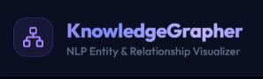

# Knowledge Grapher



**Knowledge Grapher** is an AI-powered NLP Text-to-Entity Knowledge Graph Visualizer. It takes raw, unstructured text inputs, automatically extracts key entities and their complex relationships using Natural Language Processing (via LLMs like Groq), and transforms them into interactive, visual knowledge graphs.

This application is designed to help users quickly digest complex information, understand core subjects, and map out connections within large bodies of text effortlessly.

---

## 🎥 Demo Video

<video src="https://raw.githubusercontent.com/Steve-B17/KnowledgeGrapher/main/assets/demo.mp4" controls="controls" muted="muted" playsinline="playsinline" style="max-width: 100%;">
  Your browser does not support the video tag.
</video>

*(Note: If the video above does not play directly in your browser, you can click the link to download or view it.)*

---

## ✨ Key Features

- **Automated Extraction:** Leverages advanced AI models (Groq API) to accurately identify entities (e.g., people, organizations, concepts) and define how they relate to one another.
- **Interactive Visualization:** Renders dynamic, node-based graphs. Users can drag nodes, zoom in/out, and visually explore the web of information.
- **History & Management:** Saves past text analyses securely, allowing users to revisit, manage, and compare previously generated knowledge graphs.
- **Secure Access:** Built-in JWT authentication ensures that user data and generated graphs remain private and personalized to each account.

---

## 🛠 Tech Stack

### Frontend (Client)
- **Framework:** React with Vite
- **Styling:** Tailwind CSS
- **Visualization:** HTML Canvas / Graphing Libraries (e.g., react-force-graph)

### Backend (Server)
- **Runtime:** Node.js
- **Framework:** Express.js
- **Database:** MongoDB with Mongoose (Object Data Modeling)
- **AI/NLP Engine:** Groq LLM API integration for rapid text processing
- **Authentication:** JSON Web Tokens (JWT) & bcrypt for password hashing

---

## 🚀 Getting Started Locally

Follow these instructions to set up the project on your local machine for development and testing.

### Prerequisites
Before you begin, ensure you have the following installed:
- [Node.js](https://nodejs.org/en/) (v16 or higher)
- [MongoDB](https://www.mongodb.com/) (Running locally or a MongoDB Atlas cluster)
- A [Groq API Key](https://console.groq.com/) for the NLP extraction

### 1. Clone the Repository
```bash
git clone https://github.com/Steve-B17/KnowledgeGrapher.git
cd KnowledgeGrapher
```

### 2. Environment Variables

**Backend (`server/.env`)**
Create a `.env` file inside the `server/` directory:
```env
PORT=5000
MONGO_URI=your_mongodb_connection_string
JWT_SECRET=your_super_secret_jwt_key
GROQ_API_KEY=your_groq_api_key
```

**Frontend (`client/.env`)** (Optional, if required by your setup)
Create a `.env` file inside the `client/` directory:
```env
VITE_API_URL=http://localhost:5000/api
```

### 3. Installation & Running

The project is split into a `client` and a `server`. You will need to start both.

**Start the Backend Server:**
Open a terminal and run:
```bash
cd server
npm install
npm run dev
```

**Start the Frontend Client:**
Open a new terminal window and run:
```bash
cd client
npm install
npm run dev
```

### 4. Usage
- Open your browser and navigate to `http://localhost:5173` (or the port Vite provides).
- Create an account or log in.
- Paste any complex text (like an article, wiki page, or document) into the input box.
- Click "Generate" and wait for the AI to process the text.
- Interact with the generated knowledge graph!

---

## 📝 License
This project is licensed under the MIT License.
